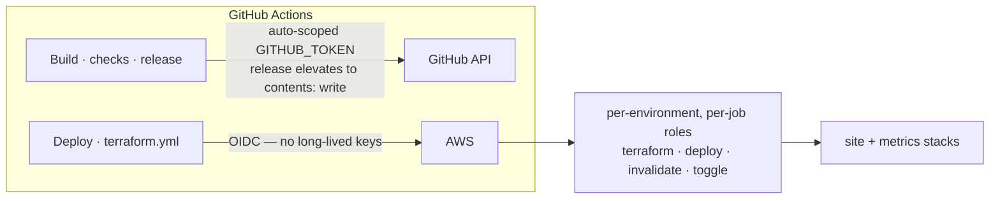

# Workflows — CI/CD Implementation Reference

Every workflow in `.github/workflows/` — what it does, how it's triggered, which roles and
secrets it uses, and the gotchas. The **system view** (how a change ships) lives in the root
[`README.md`](../README.md#ci--cd); this file is the implementation detail. The **process**
(branching, the required-checks table, issues/labels, releases) lives in
[`CONTRIBUTING.md`](../CONTRIBUTING.md).

## Naming conventions

- **File names** — `{task}-{env|language|resource}` (`deploy-staging-s3.yml`,
  `checks-python.yml`, `invalidate-cloudfront.yml`); task-only names for single-purpose files
  (`ci.yml`, `release.yml`).
- **Display names** — quoted `{Category}: {Task}` (a colon+space is invalid unquoted YAML):
  `Build` · `Checks: {language}` · `Deploy: {env} {target}` · `Infra: {task}`.
- **`workflow_run` matches display names** — the deploy workflows watch `Build`; renaming a
  display name requires updating every `workflow_run` reference.

## Build — `ci.yml` (`Build`)

- **Triggers:** push to `main` and `v*` tags; pull requests to `main`.
- Runs the shared [`.github/actions/build-site`](../.github/actions/build-site) action: pip cache,
  `mkdocs build --strict`, translation-parity check, `pip-audit` dependency audit, internal link
  check, CSS sanity check — with the per-environment `site_url` (tags → prod, main → staging)
  and `METRICS_ENDPOINT`.
- Uploads the built `site/` as an artifact (7-day retention).

## Checks — `checks-{shell,python,js,terraform,yml}.yml`

- **Triggers:** pull requests + manual dispatch, with a job-level **relevance gate**
  (`dorny/paths-filter`): when a PR touches none of the surface's files the check **skips and
  reports success** — GitHub treats skipped jobs as success, so requiring all checks never
  blocks unrelated PRs.
- **Surfaces:** `shellcheck` on every `*.sh` (repo-wide, excluding `site/`) + `.githooks/**` ·
  `ruff` on `**/*.py` ·
  `node --check` on `**/*.js` (project + vendored) · actionlint + YAML parse on `**/*.yml`/`**/*.yaml`
  workflow-file edits self-validate) · terraform stages on `terraform/**` + `.tflint.hcl`
  (`fmt -check`,
  `validate` on all three roots, TFLint, Checkov — informational, no AWS credentials).
- **Required checks are the job names** — see the table in `CONTRIBUTING.md` (the `main`
  ruleset enforces them).
- **Local parity:** `check-compose.yaml` mirrors the workflows exactly (one service per check,
  identical commands + tool images); `scripts/check_changed.sh` runs changed-files-only
  (pre-commit friendly: `git config core.hooksPath .githooks`). The GitHub workflows remain the
  authoritative gate.
- **`checks-rulesets.yml` (`Checks: Rulesets`)** — ruleset **drift check**: `scripts/check_ruleset_drift.py`
  compares each `rulesets/*.json` (config-as-code) against the live ruleset via the API
  (normalized: runtime fields dropped, list order insignificant). Runs on main merges touching
  `rulesets/**`, on a daily schedule (catches UI-side edits), and manually. No auto-apply.

## Deploy — `workflow_run` on Build success

The two S3 deploys share the same shape: download the artifact (`run-id` of the triggering
Build), assume the per-environment **deploy role** (OIDC), `aws s3 sync` to the bucket root,
then assume the **invalidate role** for an inline `/*` invalidation (lookup by the
`<project>-<env>-site` comment convention; skip when the distro is absent). The Pages deploy
never touches AWS (see below).

| Workflow | Runs on | Environment | Target | Gate |
| --- | --- | --- | --- | --- |
| `deploy-staging-s3.yml` | Build success on `main` | `staging` (auto, ungated) | `<project>-staging-site` (S3 + CloudFront) | content-hash skip (below) |
| `deploy-pre-prod-s3.yml` | Build success on `v*` tags | `pre-prod` | `<project>-prod-site` (S3 + CloudFront) — AWS mirror | tag only |
| `deploy-prod-pages.yml` | Build success on `v*` tags | `prod` (required reviewer) | GitHub Pages (canonical) | tag only + approval |

- **Least privilege:** the Pages job uses the official Pages actions
  (`configure-pages` → `upload-pages-artifact` → `deploy-pages`) with `pages: write` +
  `id-token: write` and **no `contents: write`** (`contents: read` + `actions: read` cover the
  artifact download); a `concurrency: group: pages` guard serializes deploys. **Requires** the
  repo Pages setting: source = **GitHub Actions** (flip right before the next `v*` deploy).
- **Secrets** stay repo-level with per-environment prefixes (env-scoped secrets are a future idea).

### Content-hash skip (staging)

Deploys on `main` skip sync + invalidation when the artifact is **byte-identical** to the last
staging deploy. Marker: a zero-byte object keyed by a SHA-256 of the site content under
`.deploy-hash/<hash>`, existence-checked with `s3 ls` — the deploy role deliberately has **no
`s3:GetObject`**, so the marker is written (`s3api put-object`) and listed, never read. The sync
excludes `.deploy-hash/*` so the marker survives `--delete`.

- **Why content, not commits:** the old commit-diff gate (`HEAD~1..HEAD`) let multi-commit
  batches go stale; content comparison can't — a skip only happens when the exact bytes to sync
  are already live.
- **Gotcha:** `aws s3 sync` compares size + mtime — freshly extracted artifacts always
  re-upload; the hash skip is what prevents it.
- **Edge case:** git-revision-date embeds can change the hash at day boundaries — then it
  deploys as usual (never stale, best-effort).

## Release — `release.yml`

- **Triggers:** `v*` tags or manual dispatch. Packages `site.zip`, generates a CycloneDX SBOM
  (`sbom.cdx.json`) from `requirements.txt`, and creates/refreshes a GitHub Release with notes
  from `CHANGELOG.md`.
- Releases do **not** drive deploys (tags do) — they publish the SBOM, artifact, and notes.

## Infra — `terraform.yml` + operational extras

- **`terraform.yml`** — plans on any change to `terraform/**`: `main` → staging (auto-apply),
  `v*` tags → prod (plan only — apply stays manual via `workflow_dispatch`). Deep docs:
  [`terraform/README.md`](../terraform/README.md).
- **`toggle-env.yml`** + `scripts/toggle_cloudfront.sh` — manual dispatch: disable/enable
  **staging** CloudFront distributions (component `site`|`metrics` × action `disable`|`enable`)
  by flipping `Enabled` in place (no terraform apply, nothing deleted). **Staging only by
  design** — prod has no toggle role. Caveat: the flag lives outside terraform state, so the
  next apply restores `enabled=true`. Uses the staging edge-toggle role (per-env secret).
- **`invalidate-cloudfront.yml`** + `scripts/invalidate_cloudfront.sh <staging|prod> [paths]` —
  manual edge purges for out-of-band content changes (the reference implementation for the
  inline deploy invalidation):

  ```sh
  scripts/invalidate_cloudfront.sh staging            # full invalidation (/*)
  scripts/invalidate_cloudfront.sh prod "/about/ /metrics/"   # specific paths
  ```

## Auth model



Build/checks/release talk to the GitHub API with the auto-scoped `GITHUB_TOKEN` (Release
elevates it to `contents: write` to create the Release). Deploys and Terraform assume **AWS
roles via OIDC** — one least-privilege role per job per environment; the only key-based step is
the out-of-band `terraform/ci` bootstrap, run as an AWS user.

The per-environment role ARNs and deployment values live as **repo secrets** (Settings → Secrets
and variables → Actions), referenced by name from the workflows. Names follow a fixed pattern
(`ENV` ∈ `STAGING` / `PROD`):

| Pattern | Purpose |
| --- | --- |
| `{ENV}_DEPLOY_ROLE_ARN` · `{ENV}_INVALIDATE_ROLE_ARN` | S3 sync + edge purge roles |
| `{ENV}_TERRAFORM_ROLE_ARN` | plan/apply role |
| `{ENV}_TOGGLE_ROLE_ARN` | edge on/off flip (staging only) |
| `PROJECT` · `AWS_REGION` | shared — bucket naming, region |
| `{ENV}_ALLOWED_ORIGIN` · `{ENV}_METRICS_ENDPOINT` · `{ENV}_SITE_URL` | per-env build/run values |

Terraform variables (`project`, `environment`, `aws_region`, `allowed_origin`, `tags`) are
injected from those secrets (CI) or `local.tfvars` (local dev) — nothing is hardcoded.
