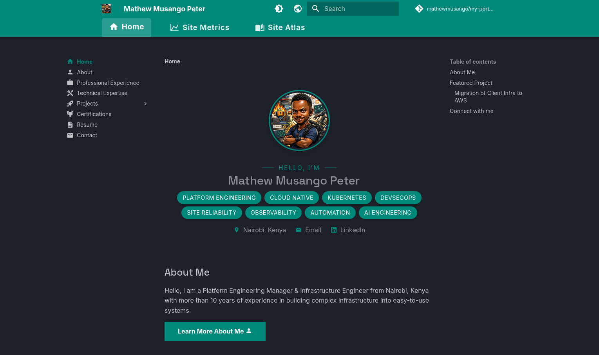
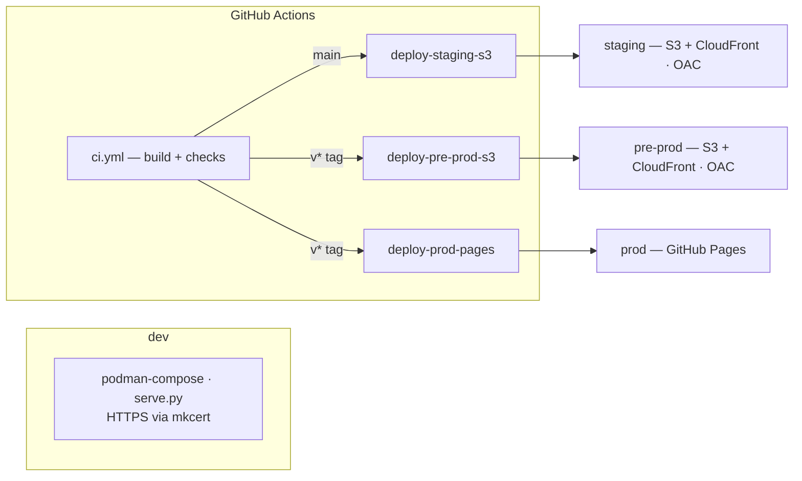
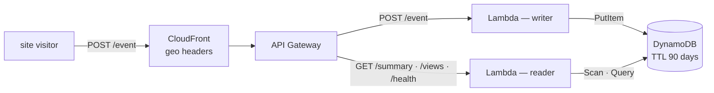
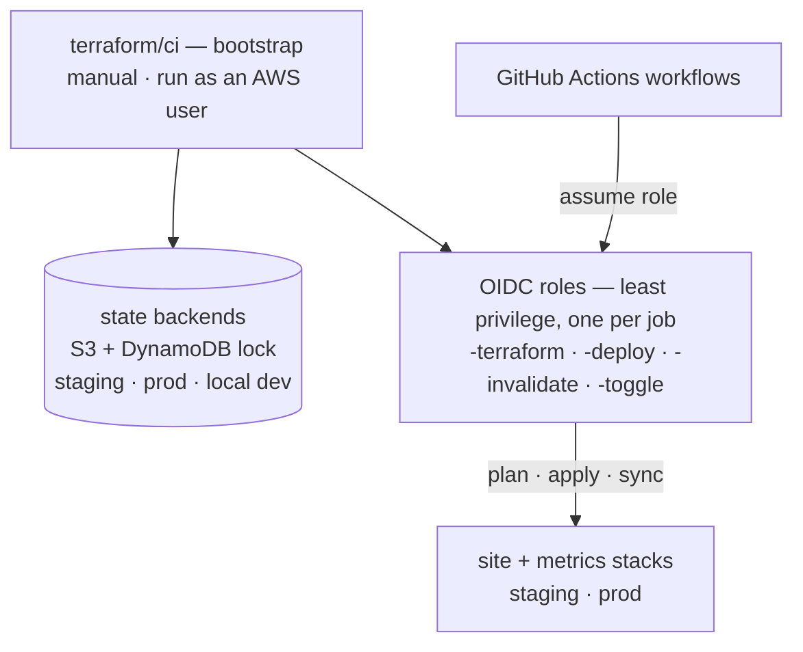
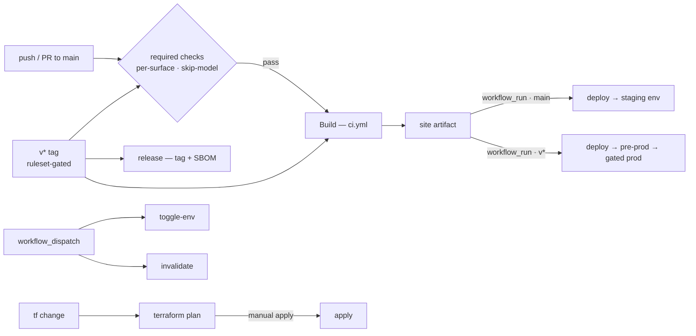

# My Portfolio

[](mailto:musangomathew@gmail.com)
[](https://mathewmusango.github.io/my-portfolio/)
[](https://github.com/mathewmusango/my-portfolio/releases)
[](https://github.com/mathewmusango/my-portfolio/blob/main/LICENSE)
[](https://github.com/mathewmusango/my-portfolio/actions)
[](https://github.com/mathewmusango/my-portfolio/releases)
[](https://github.com/mathewmusango/my-portfolio/actions)


*The live site — [mathewmusango.github.io/my-portfolio](https://mathewmusango.github.io/my-portfolio/)*

> **Personal project developed in the open** — the OSS-style process (PRs, checks,
> releases) is a deliberate practice, not a community project.

Personal portfolio site for **Mathew Musango Peter** (Platform Engineering Manager), built with
MkDocs + Material and shipped to production standards: gated multi-environment releases,
least-privilege OIDC roles, and privacy-first visitor analytics (no IPs stored). The personal
side — profile, experience, certifications, resume — is on the site; this repository is the
engineering behind it ([Architecture](#architecture)).

> Code is MIT-licensed (see [LICENSE](LICENSE)). All personal content — text, resume,
> certifications, and images — © Mathew Musango Peter, all rights reserved.

## Tech Stack

| Layer      | Tooling                                                               |
| ---------- | --------------------------------------------------------------------- |
| Site       | [MkDocs](https://www.mkdocs.org/) 1.6.1 + [Material](https://squidfunk.github.io/mkdocs-material/) 9.7.7 |
| Theme      | Material — dark slate (default), light toggle, teal `#00897b` accent   |
| Plugins    | Search (suggest/highlight), git revision dates + contributors, minify |
| PDF viewer | pdf.js (self-hosted) with clickable, new-tab links overlays            |
| Analytics  | Privacy-first visitor metrics — CloudFront geo headers → API Gateway → Lambda → DynamoDB (no IPs stored, 90-day TTL) |

## Architecture

The project is a three-part platform — content delivery, visitor metrics, and the Terraform
behind both. Each part ships through real CI/CD; the deep detail lives in
[CI / CD](#ci--cd), [Terraform](#infrastructure-as-code-terraform) and
[`terraform/README.md`](terraform/README.md).

### Site — content delivery



**Prod is gated**: the Pages deploy runs in the `prod` GitHub environment behind a required
reviewer — `pre-prod` (the AWS mirror) lands first so it can be verified, then Pages ships on
approval. Each deploy assumes its own OIDC deployment role (`-deploy`). Creating a `v*` tag is
also ruleset-protected — restricted to the maintainer — so releases can't be minted by accident.

Two delivery planes, each with its own prod gate: **application/content** — `main` → staging ·
`v*` → pre-prod → gated prod (GitHub Pages); **infrastructure** — `main` → staging applies
automatically, `v*` → prod is plan-only (apply stays manual).

### Metrics — visitor analytics



**staging** runs its own stack; **pre-prod + prod** share one; **dev** runs Ministack (no edge).
Writer and reader lambdas each have their own least-privilege role. Privacy-first: geo only — no
IPs stored, raw events expire — CloudFront supplies the geo headers, so no IP address ever
reaches the Lambda ([Why CloudFront?](terraform/README.md#why-cloudfront)).

### Terraform — the control plane



`terraform/ci` creates the per-environment state backends and the OIDC roles GitHub Actions
assumes to build and run the stacks. **Bootstrap is the one out-of-band step**: it runs once
outside GitHub Actions, from an AWS user whose own IAM permissions create the state backends and
the roles — no workflow is ever involved. From then on GitHub Actions assumes the OIDC roles
directly, so no long-lived credentials are used by any workflow. **Operational extras
(pluggable):** `toggle-env` flips staging CloudFront edges on/off; CloudFront invalidation
purges the edge (inline in deploys, or manual via `invalidate-cloudfront.yml`).

Cross-cutting security — OIDC only (no long-lived keys) · buckets never public (OAC) ·
origin-gated metrics API · `pip-audit` on every build + CycloneDX SBOM per release
([Security](#security)).

## Getting Started

**Prerequisites**

- [Podman](https://podman.io/) + [podman-compose](https://github.com/containers/podman-compose) — the
  dev server and all tooling run in containers; **no local Python/venv needed**.
- [mkcert](https://github.com/FiloSottile/mkcert) — local HTTPS (once per machine).

**One-time local setup** — trust the local CA, generate the site cert into `certs/` (gitignored),
and map the dev host:

```sh
mkcert -install                                  # trust the local root CA
mkdir -p certs
mkcert -cert-file certs/portfolio.pem -key-file certs/portfolio-key.pem \
  portfolio.mathewmusango.test localhost 127.0.0.1
echo "127.0.0.1 portfolio.mathewmusango.test" | sudo tee -a /etc/hosts
```

**Run**

```sh
git clone https://github.com/mathewmusango/my-portfolio.git
cd my-portfolio
podman-compose -f compose.yaml up -d
```

Open <https://portfolio.mathewmusango.test:8000> — the dev server (live-reload) also exposes a
`/health` endpoint. See [Development](#development) for how the container maps to CI/CD.

## Development

The repository is the **single source of truth** — the same `docs/` tree builds the local site and
the deployed one. Setup and first run are in [Getting Started](#getting-started); the details:

- **Live-reload dev server** — `compose.yaml` (podman, container `my-portfolio`) runs
  `scripts/serve.py`, an HTTPS-capable MkDocs dev server that also exposes `/health` (the
  container healthcheck curls it).
- **HTTPS** — served over TLS with the local [mkcert](https://github.com/FiloSottile/mkcert) CA
  (certs in `certs/`, gitignored); compose passes the cert paths to `serve.py`, which falls back
  to plain HTTP with a warning if they're missing.
- Commits to `main` are built, checked, and deployed automatically by GitHub Actions — see
  [CI / CD](#ci--cd).

## CI / CD

How a change ships (the [Architecture](#architecture) site diagram shows the targets):



- **Build** (`.github/workflows/ci.yml`) — on every push/PR to `main` **and `v*` tags**: shared
  build action (pip cache, `mkdocs build --strict`, `pip-audit` dependency audit, internal link
  check, CSS sanity check) with the per-environment `site_url` (tags → prod, main → staging); uploads the built `site/` as an
  artifact (7-day retention).
- **Terraform checks** (`.github/workflows/checks-terraform.yml`) — static checks on the
  terraform code (on pull requests, or manual dispatch — the stage checks skip, green, when
  `terraform/**` isn't touched):
  `terraform fmt -check`, `validate`
  (all three roots: `terraform/`, `terraform/ci/`, `modules/metrics`), TFLint, and a Checkov
  security scan (informational for now). No AWS credentials — this complements (does not
  replace) the `terraform.yml` plan/apply pipeline.
- **Per-surface checks** (`.github/workflows/checks-{shell,python,js,terraform,yml}.yml`) —
  one workflow per surface, running on pull requests (or manual dispatch) with a job-level
  relevance gate (`dorny/paths-filter`): when the PR touches none of the surface's files the
  check **skips and reports success** — GitHub treats skipped jobs as success — so requiring all
  checks never blocks unrelated PRs. Covers: `shellcheck` on `scripts/*.sh` + `.githooks/**`,
  `ruff` on `**/*.py`, `node --check` on `**/*.js` (project + vendored), actionlint + YAML parse
  on `**/*.yml`/`**/*.yaml` (workflow-file edits self-validate), and the terraform stage checks
  on `terraform/**`.
- **Local checks** (`check-compose.yaml`) — the same checks run locally as stage 1, one compose
  service per check (`podman-compose -f check-compose.yaml run --rm <shell|python|yaml|yaml-syntax|js>`),
  mirroring the GitHub workflows exactly (same commands + tool images). **Changed-files-only:**
  `scripts/check_changed.sh` (pre-commit friendly; install with `git config core.hooksPath .githooks`).
  The GitHub workflows remain the authoritative gate (stage 2).
- **Deploy staging s3** (`.github/workflows/deploy-staging-s3.yml`) — on CI success for `main` pushes:
  syncs the artifact to the **staging S3 bucket** (`<project>-staging-site`) with the S3-only
  deploy role, then invalidates CloudFront with the edge-invalidate role (least privilege —
  `STAGING_DEPLOY_ROLE_ARN` + `STAGING_INVALIDATE_ROLE_ARN`). The `staging` environment.
- **Deploy pre-prod s3** (`.github/workflows/deploy-pre-prod-s3.yml`) — on CI success for **`v*` tags only**:
  syncs the artifact to the **prod S3 bucket** (`<project>-prod-site`) + CloudFront
  invalidation (OIDC `PROD_DEPLOY_ROLE_ARN` + `PROD_INVALIDATE_ROLE_ARN`) — the **`pre-prod`**
  environment (AWS mirror of the canonical site).
- **Deploy prod pages** (`.github/workflows/deploy-prod-pages.yml`) — on CI success for **`v*` tags
  only**: publishes the artifact to **GitHub Pages** (the public site at
  <https://mathewmusango.github.io/my-portfolio/>) via the official Pages actions
  (`configure-pages` → `upload-pages-artifact` → `deploy-pages`) — **least privilege**: only
  `pages: write` + `id-token: write`, no `contents: write`; the **`prod`** environment. Requires
  the repo Pages setting: source = **GitHub Actions** (flip right before the next `v*` deploy).
- **Environments:** the deploy workflows declare per-environment environments — `staging` (auto,
  ungated), `pre-prod` (AWS mirror), `prod` (GitHub Pages). Required reviewers are configured per
  environment in Settings (recommended: required reviewer only on `prod`, so the mirror lands
  first for verification and the canonical site follows on approval). Secrets stay repo-level for
  now (`STAGING_*` / `PROD_*` prefixes); env-scoped secrets are a future idea.
- **Toggle env** (`.github/workflows/toggle-env.yml` + `scripts/toggle_cloudfront.sh`) — manual
  dispatch: **disable/enable STAGING CloudFront distributions** (component `site`|`metrics`,
  action disable|enable) by flipping `Enabled` in place via the AWS CLI —
  the invalidation-style toggle: no terraform apply runs, nothing can be deleted. **Staging only by
  design** — prod has no toggle role (an accidental disable on the prod metrics edge would stop
  collection). Uses the staging edge-toggle role (`STAGING_TOGGLE_ROLE_ARN`). Caveat: the flag
  lives outside terraform state, so the next apply restores it to enabled.
- **CloudFront invalidation** — the deploy jobs run their own **inline** `/*` invalidation
  right after the sync (atomic with the deploy: lookup by the `<project>-<env>-site` comment
  convention, skip when the distro is absent). Manual purges (out-of-band content changes) go
  through `invalidate-cloudfront.yml` (`workflow_dispatch`) or locally via
  `scripts/invalidate_cloudfront.sh <staging|prod> [paths]` — the reference implementation if
  the inline steps are ever centralized:

  ```sh
  # Reference — the script used by the manual paths (also the centralized pattern)
  scripts/invalidate_cloudfront.sh staging            # full invalidation (/*)
  scripts/invalidate_cloudfront.sh prod "/about/ /metrics/"   # specific paths
  ```
- **Release** (`.github/workflows/release.yml`) — on `v*` tags (or manual dispatch): builds,
  packages `site.zip`, generates a CycloneDX SBOM (`sbom.cdx.json`) from `requirements.txt`,
  and creates/refreshes a GitHub Release with notes from `CHANGELOG.md`.

Build and release workflows use only the auto-scoped `GITHUB_TOKEN`. Deploys and Terraform
assume AWS roles via **OIDC** (no long-lived keys) using repo secrets: `STAGING/PROD_TERRAFORM_ROLE_ARN`,
`STAGING/PROD_DEPLOY_ROLE_ARN`, `STAGING/PROD_INVALIDATE_ROLE_ARN`, `STAGING_TOGGLE_ROLE_ARN`,
`PROJECT`, `AWS_REGION`, `STAGING/PROD_ALLOWED_ORIGIN`,
`STAGING/PROD_METRICS_ENDPOINT`, `STAGING/PROD_SITE_URL`. No deployment value is hardcoded — terraform variables
(`project`, `environment`, `aws_region`, `allowed_origin`, `tags`) are injected at runtime from
secrets (CI) or `local.tfvars` (local dev).

## Infrastructure as Code (Terraform)

Real AWS infrastructure, defined with **Terraform** — a site + metrics stack:

- **Site (live)** — private S3 bucket + CloudFront (OAC, HTTP/2+3, localized error pages,
  serving at `/`). The staging and prod sites deploy here via the workflows above; buckets are
  **never public** (origin access control only).
- **Metrics (live — both environments)** — API Gateway → Lambda → DynamoDB behind a
  geo-enabled CloudFront edge (visitor country/city from CloudFront headers — no IPs are
  stored, raw events expire after 90 days via DynamoDB TTL). **Free-Tier by default**: least-
  privilege IAM, an edge origin-gate (403 for non-site origins, HTTPS only) and multi-origin
  CORS (auto-includes the site's own CloudFront domain). WAF + a private VPC are opt-in behind
  `enable_waf`/`enable_vpc`.
- **Per-environment roles split by job (least privilege)**: `-terraform` (stack plan/apply,
  tag-locked for prod) · `-deploy` (S3 content sync only) · `-invalidate` (edge purge) ·
  `-toggle` (edge `Enabled` flip, staging only) — each workflow assumes only the role its step needs.
- Applied via GitHub Actions using OIDC — the environment comes from the trigger (main →
  staging, `v*` tags → prod). **Staging applies automatically on `main`; prod plans only — its
  apply stays manual.** No state or secrets are ever committed; state lives in per-env private
  S3 backends with DynamoDB locking.

Deeper, stack-level documentation (resources, event schema, local Ministack workflow) lives in
[`terraform/README.md`](terraform/README.md).

## Security

- See [SECURITY.md](SECURITY.md) for the vulnerability reporting policy.
- **Dependabot** keeps `requirements.txt` (weekly) and GitHub Actions (monthly) up to date.
- Every release ships an SBOM, and `pip-audit` runs on every CI build.

## License

[MIT](LICENSE)
