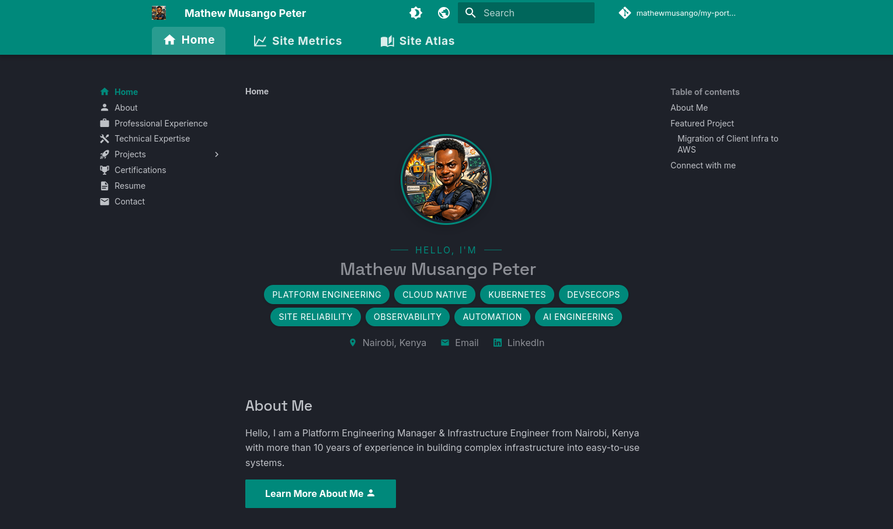
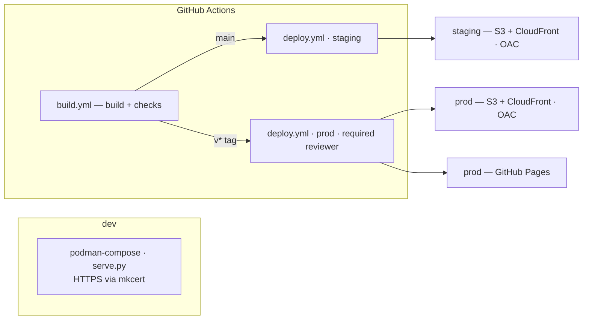
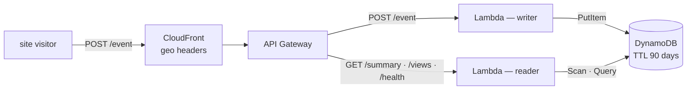
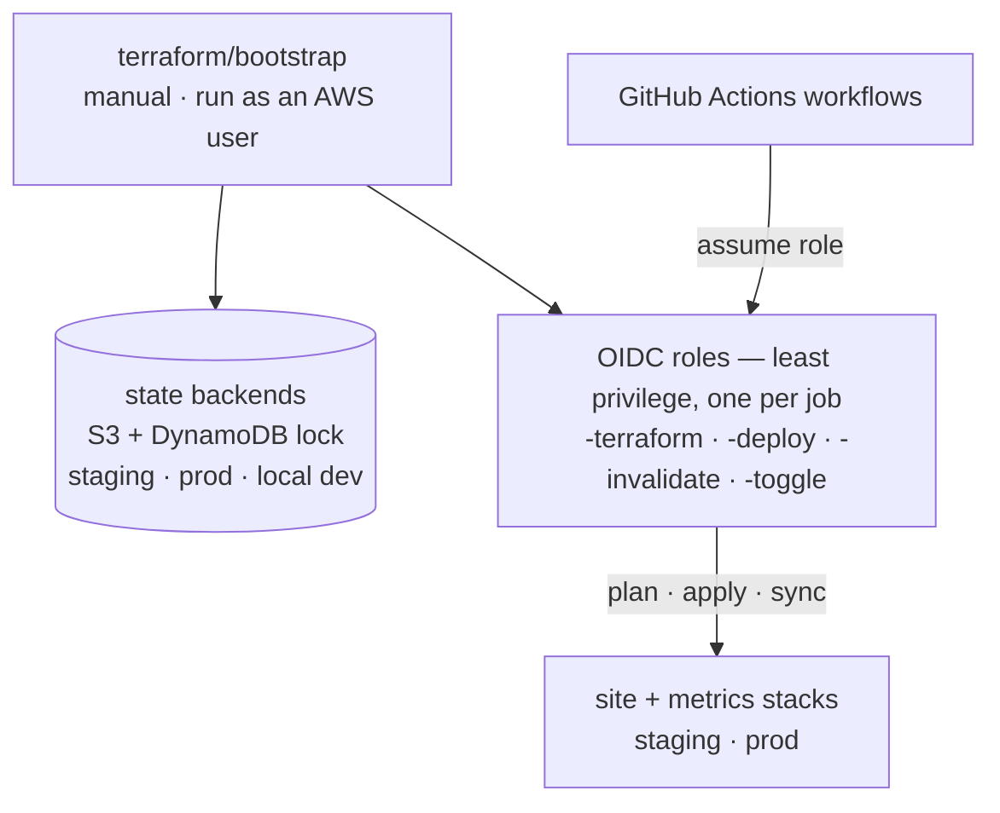
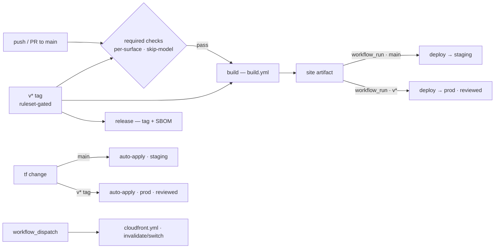

# My Portfolio

[](mailto:musangomathew@gmail.com)
[](https://mathewmusango.github.io/my-portfolio/)
[](https://github.com/mathewmusango/my-portfolio/releases)
[](https://github.com/mathewmusango/my-portfolio/blob/main/LICENSE)
[](https://github.com/mathewmusango/my-portfolio/actions)


*The live site — [mathewmusango.github.io/my-portfolio](https://mathewmusango.github.io/my-portfolio/)*

> **Personal project developed in the open** — the OSS-style process (PRs, checks,
> releases) is a deliberate practice, not a community project.

Personal portfolio site for **Mathew Musango Peter** (Platform Engineering Manager), built with
MkDocs + Material and shipped to production standards: gated multi-environment releases,
least-privilege OIDC roles, and privacy-first visitor analytics (no IPs stored). The personal
side — profile, experience, certifications, resume — is on the site; this repository is the
engineering behind it ([Architecture](#architecture)).

> Code is MIT-licensed (see [LICENSE](LICENSE)). All personal content — text, resume,
> certifications, and images — © Mathew Musango Peter, all rights reserved.

## Tech Stack

| Layer      | Tooling                                                               |
| ---------- | --------------------------------------------------------------------- |
| Site       | [MkDocs](https://www.mkdocs.org/) 1.6.1 + [Material](https://squidfunk.github.io/mkdocs-material/) 9.7.7 |
| Theme      | Material — dark slate (default), light toggle, teal `#00897b` accent   |
| Plugins    | Search (suggest/highlight), git revision dates + contributors, minify |
| PDF viewer | pdf.js 6.3.289 (self-hosted, ESM) with clickable, new-tab links overlays |
| Vendored JS | pdf.js · Mermaid · Tablesort version-pinned in `package.json` for Dependabot visibility |
| Analytics  | Privacy-first visitor metrics — CloudFront geo headers → API Gateway → Lambda → DynamoDB (no IPs stored, 90-day TTL) |

## Architecture

The project is a three-part platform — content delivery, visitor metrics, and the Terraform
behind both. Each part ships through real CI/CD; the deep detail lives in
[CI / CD](#ci--cd), [Terraform](#infrastructure-as-code-terraform) and
[`terraform/README.md`](terraform/README.md).

### Site — content delivery


```mermaid
flowchart LR
    subgraph Local[dev]
        DEV[podman-compose · serve.py<br/>HTTPS via mkcert]
    end
    subgraph GHA[GitHub Actions]
        B[build.yml — build + checks] -->|main| DS[deploy.yml · staging]
        B -->|v* tag| DP[deploy.yml · prod · required reviewer]
    end
    DS --> STG[staging — S3 + CloudFront · OAC]
    DP --> PAWS[prod — S3 + CloudFront · OAC]
    DP --> PPAGES[prod — GitHub Pages]
```

**Prod is gated**: `v*` ships one artifact to both prod planes — the AWS mirror (S3 +
CloudFront) and GitHub Pages (the canonical site) — and **both** wait on the required reviewer in
the `prod` GitHub environment, so nothing reaches prod unreviewed. Two delivery planes, each with
its own gate: **content** — `main` → staging · `v*` → prod (reviewed); **infrastructure** — `main`
→ staging auto-applies · `v*` → prod applies (reviewed).

### Metrics — visitor analytics


```mermaid
flowchart LR
    V[site visitor] -->|POST /event| CF[CloudFront<br/>geo headers]
    CF --> GW[API Gateway]
    GW -->|POST /event| W[Lambda — writer]
    GW -->|GET /summary · /views · /health| R[Lambda — reader]
    W -->|PutItem| DB[(DynamoDB<br/>TTL 90 days)]
    R -->|Scan · Query| DB
```

**staging** runs its own stack; **prod** runs one; **dev** runs Ministack (no edge).
Writer and reader lambdas each have their own least-privilege role. Privacy-first: geo only — no
IPs stored, raw events expire — CloudFront supplies the geo headers, so no IP address ever
reaches the Lambda ([Why CloudFront?](terraform/README.md#why-cloudfront)).

### Terraform — the control plane


```mermaid
flowchart TB
    BOOT[terraform/bootstrap<br/>manual · run as an AWS user] --> STATE[(state backends<br/>S3 + DynamoDB lock<br/>staging · prod · local dev)]
    BOOT --> ROLES[OIDC roles — least privilege, one per job<br/>-terraform · -deploy · -invalidate · -toggle]
    WORK[GitHub Actions workflows] -->|assume role| ROLES
    ROLES -->|plan · apply · sync| STACKS[site + metrics stacks<br/>staging · prod]
```

`terraform/bootstrap` creates the per-environment state backends and the OIDC roles GitHub Actions
assumes to build and run the stacks. **Bootstrap is the one out-of-band step** — an AWS user,
outside GitHub Actions, creates them with its own IAM permissions; no workflow ever uses keys.

## Getting Started

**Prerequisites**

- [Podman](https://podman.io/) + [podman-compose](https://github.com/containers/podman-compose) — the
  dev server and all tooling run in containers; **no local Python/venv needed**.
- [mkcert](https://github.com/FiloSottile/mkcert) — local HTTPS (once per machine).

**One-time local setup** — trust the local CA, generate the site cert into `certs/` (gitignored),
and map the dev host:

```sh
mkcert -install                                  # trust the local root CA
mkdir -p certs
mkcert -cert-file certs/portfolio.pem -key-file certs/portfolio-key.pem \
  portfolio.mathewmusango.test localhost 127.0.0.1
echo "127.0.0.1 portfolio.mathewmusango.test" | sudo tee -a /etc/hosts
```

**Run**

```sh
git clone https://github.com/mathewmusango/my-portfolio.git
cd my-portfolio
scripts/dev.sh build
scripts/dev.sh start
```

Open <https://portfolio.mathewmusango.test:8000> — the dev server (live-reload) also exposes a
`/health` endpoint. See [Development](#development) for how the container maps to CI/CD.

## Development

The repository is the **single source of truth** — the same `docs/` tree builds the local site and
the deployed one. Setup and first run are in [Getting Started](#getting-started); the details:

- **Live-reload dev server** — `containers/site/compose.yaml` (podman, container `my-portfolio`) runs
  `scripts/serve.py`, an HTTPS-capable MkDocs dev server that also exposes `/health` (the
  container healthcheck curls it). [`scripts/dev.sh`](scripts/README.md) drives the container's
  build, start, restart and stop.
- **HTTPS** — TLS via the local [mkcert](https://github.com/FiloSottile/mkcert) CA (certs in
  `certs/`, gitignored); `serve.py` falls back to plain HTTP with a warning if the certs are
  missing. Setup commands are in [Getting Started](#getting-started).
- Commits to `main` are built, checked, and deployed automatically by GitHub Actions — see
  [CI / CD](#ci--cd).

## CI / CD

How a change ships (the [Architecture](#architecture) site diagram shows the targets):


```mermaid
flowchart LR
    M[push / PR to main] --> C{required checks<br/>per-surface · skip-model}
    V[v* tag<br/>ruleset-gated] --> C
    C -->|pass| B[build — build.yml]
    V --> B
    B --> A[site artifact]
    A -->|workflow_run · main| S[deploy → staging]
    A -->|workflow_run · v*| P[deploy → prod · reviewed]
    V --> R[release — tag + SBOM]
    T[tf change] -->|main| TS[auto-apply · staging]
    T -->|v* tag| TP[auto-apply · prod · reviewed]
    X[workflow_dispatch] --> CF[cloudfront.yml · invalidate/switch]
```

- **build** (`build.yml`) — strict `mkdocs build` + audits (pip-audit, link check) on every push/PR
  to `main` and `v*` tags; uploads the built `site/` as an artifact. The `build` job ends with a
  **browser smoke check** (`scripts/checks/browser.py`): it loads the four viewer pages in headless
  Firefox and fails when one stops rendering, which is the class of runtime regression no static
  check can see.
- **Build inputs** — the build no longer knows which environment it is for. `build-site` bakes a
  reserved-domain **placeholder** — `site_url: https://site-url.invalid/` and
  `metrics_endpoint: https://metrics-endpoint.invalid` (the `<meta name="metrics-endpoint">` tag the
  beacon needs; absent, and the beacon no-ops) — and every deploy target substitutes its own
  environment's real `SITE_URL` / `METRICS_ENDPOINT` through
  [`actions/inject-env-urls`](.github/actions/inject-env-urls/action.yml), which then asserts that no
  `.invalid` survived. That is what makes **one artifact valid for every environment**: the same build
  is promoted to staging, the prod AWS plane and gh-pages. Both values are environment **variables**
  (`SITE_URL` / `METRICS_ENDPOINT` on `staging` and `prod`). The sources differ by value:
  `terraform output -raw api_url` gives both beacon endpoints, but `-raw site_url` is right only for
  **staging** — prod's canonical is the gh-pages URL, because a tag publishes the artifact to gh-pages
  *and* the CloudFront mirror and the canonical deliberately points at gh-pages to avoid duplicate
  content, so prod's `site_url` is not the Terraform output at all. To see what a deployed page
  targets, read its own markup — `grep -oE '<link[^>]*canonical[^>]*>' site/index.html` on the
  downloaded artifact. Locally the dev server takes the endpoint from the host environment
  (`METRICS_ENDPOINT=… scripts/dev.sh start`).
- **Checks** — one workflow, `checks.yml`, calling the shared reusables in
  [`mathewmusango/my-workflows`](https://github.com/mathewmusango/my-workflows) (pinned by SHA).
  Each reusable self-gates on changed files, so an untouched surface **skips and reports success**
  and the required checks never block unrelated PRs. The checks run locally too
  (`scripts/checks/local.sh` — changed-files by default, `--full` for whole-repo, mirroring the
  workflows exactly). The Terraform leaves cache their providers and tflint plugins, and a
  **`Cache: Warm`** workflow (`warm-caches.yml`) seeds those caches from `main` — `terraform init`
  across the module dirs under `TF_PLUGIN_CACHE_DIR`, and `tflint --init` — so every PR restores them.
- **Deploy** — `workflow_run` on `build` success, all of it in `deploy.yml`: a **`detect`** job reads
  the run payload and answers both questions once — a push to `main` → **staging**, a real `v*` tag
  (resolved against the API) → **prod** — and two plain jobs gate on its outputs: **`aws-s3`** and
  **`github-pages`**, each matrixed over the environment `detect` resolved. They are **plain jobs**,
  so each declares its own `environment:` and reads `DEPLOY_ROLE_ARN` / `INVALIDATE_ROLE_ARN`
  **from that environment** — one name per environment, no `secrets:` mapping anywhere, and staging
  cannot see prod's role. The S3 plane stays one implementation
  ([`.github/actions/aws-s3`](.github/actions/aws-s3/action.yml), shared through its `env` token);
  Pages runs `prod` only. The run graph shows `aws-s3 (staging)` on a `main` push and
  `aws-s3 (prod)` + `github-pages (prod)` on a tag, so only the affected environment appears.
  Staging **skips** when the artifact is byte-identical to the last deploy (content-hash marker);
  prod always deploys.
- **Release & infra** — `v*` tags build a GitHub Release with a CycloneDX SBOM; `terraform.yml`
  runs the two roots on `terraform/**` changes and no longer needs a manual dispatch to apply — a
  push to `main` **auto-applies staging** and a `v*` tag **auto-applies prod** behind the `prod`
  reviewer (the tag gate stands, so the only automatic prod path is a tag); a `workflow_dispatch`
  still plans or applies on demand and can target one root via `stack`, and both jobs reuse a
  Terraform provider cache (the plugin cache, keyed on the lockfiles); `cloudfront.yml` — invalidate / switch, both jobs
  declaring `environment:` and reading their role ARN from it — is the manual operational extra.
  A push that cannot change the site (`docs/**`, `mkdocs.yml`, `overrides/**`, `requirements.txt`,
  the `mkdocs` hooks, a released `CHANGELOG` heading) skips the build and so the deploy, and every
  prod run — `terraform.yml` or `cloudfront.yml` — must come from a `v*` tag ref.

## Infrastructure as Code (Terraform)

Real AWS infrastructure, defined with **Terraform** — [`terraform/README.md`](terraform/README.md)
owes the full implementation (resources, event schema, security, local dev):

- **Site** — private S3 + CloudFront (OAC only — buckets are never public, localized error
  pages, serving at `/`), per environment; the deploys above sync the artifact into it.
- **Metrics** — privacy-first visitor analytics: geo comes from CloudFront headers (no IPs
  stored, 90-day TTL) via API Gateway → writer/reader lambdas → DynamoDB, origin-gated;
  WAF / private VPC are opt-in.
- **Control plane** — `terraform/bootstrap` bootstraps the per-environment state backends (S3 +
  DynamoDB lock) and the per-job OIDC roles (see [Architecture](#architecture)). Staging
  applies automatically on `main`; prod applies automatically on `v*` tags, behind the `prod`
  reviewer. State/secrets are never committed.

## Security

- See [SECURITY.md](SECURITY.md) for the vulnerability reporting policy.
- **Dependabot** keeps `requirements.txt` (weekly) and GitHub Actions (monthly) up to date.
- Every release ships a CycloneDX SBOM, and `pip-audit` runs on every CI build.
- No long-lived keys anywhere — deploys and Terraform assume AWS roles via OIDC; buckets are
  never public (OAC only) and the metrics API is origin-gated (details in
  [`terraform/README.md`](terraform/README.md)).

## Documentation map

- [`README.md`](README.md) — this file: the system view (what the repo is, architecture, running it locally).
- [`terraform/README.md`](terraform/README.md) — infrastructure implementation (site + metrics stacks, event model, security, local AWS emulation).
- [`CONTRIBUTING.md`](CONTRIBUTING.md) — the short contribution note (one-person project).
- [`SECURITY.md`](SECURITY.md) — vulnerability reporting.
- [`CHANGELOG.md`](CHANGELOG.md) — release history.
- [`rulesets/`](rulesets/) — branch/tag rulesets: [`README`](rulesets/README.md) (what they do) · `main.json`/`tags.json` (as-code configs) · `main.md`/`tags.md` (verification records).

## License

[MIT](LICENSE)
