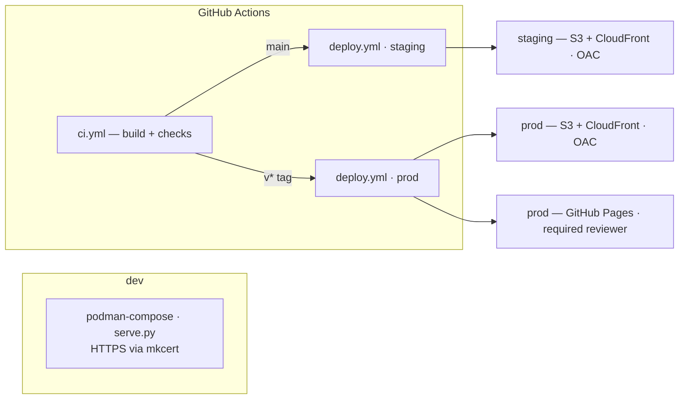
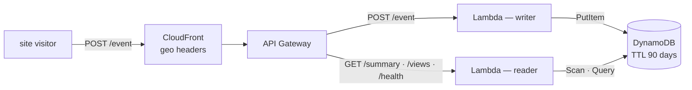
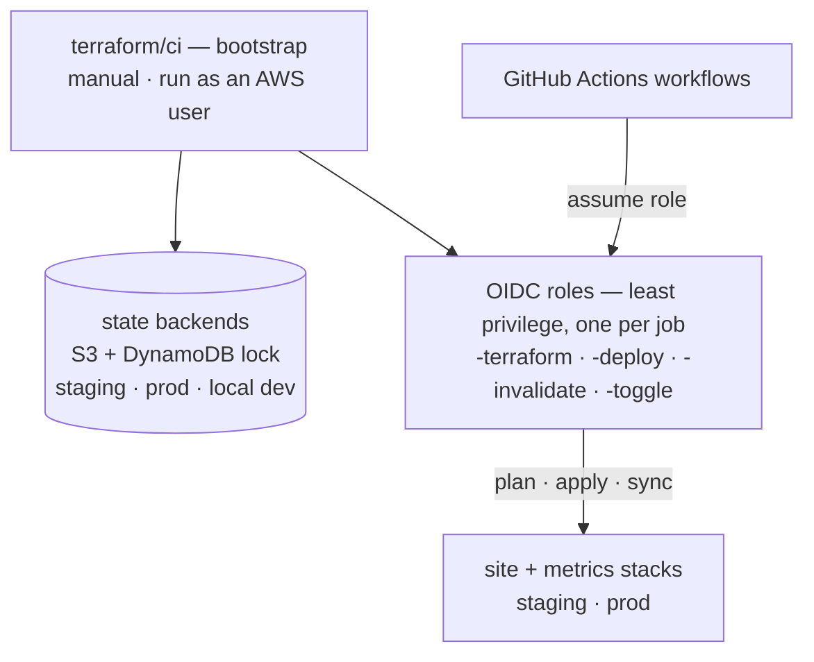
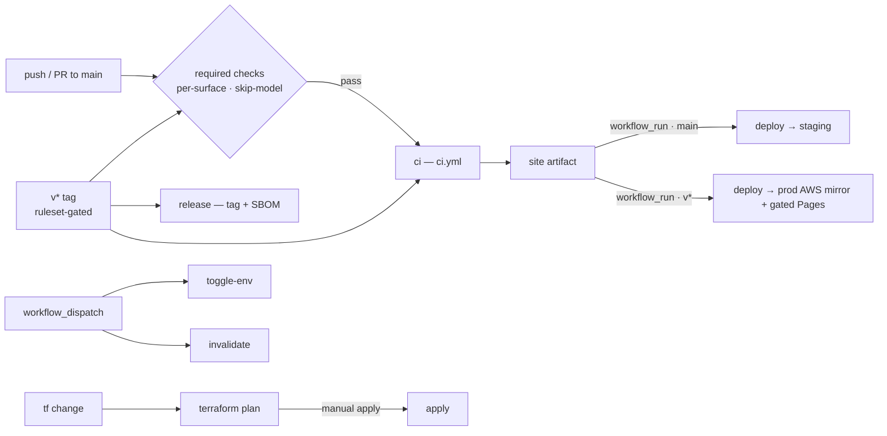

# Platform Architecture {#platform-architecture}

The [repository](https://github.com/mathewmusango/my-portfolio){ target="_blank" rel="noopener" }
behind this site is a three-part platform — **content delivery**, **visitor
metrics**, and the **Terraform control plane** behind both. These are the same
diagrams the repo
[README](https://github.com/mathewmusango/my-portfolio#architecture){ target="_blank" rel="noopener" }
carries; this page gives them a home on the site. The
[Site Structure](structure.md) map shows where pages live; this page shows how
the platform works.

## Site — content delivery

**Prod is gated**: `v*` ships one artifact to both prod planes — the AWS mirror
(S3 + CloudFront) lands first, then Pages publishes on approval from the required
reviewer on the `prod` GitHub environment. Two delivery planes, each with its own
gate: **content** — `main` → staging · `v*` → prod (AWS mirror, then gated Pages);
**infrastructure** — `main` → staging auto-applies · `v*` → prod plan-only.

## Metrics — visitor analytics

CloudFront supplies the geo headers, so **no IP address ever reaches the Lambda**
([why?](https://github.com/mathewmusango/my-portfolio/blob/main/terraform/README.md#why-cloudfront){ target="_blank" rel="noopener" }).
Writer and reader lambdas each have their own least-privilege role; the API is
public but origin-gated. **staging** runs its own stack; **prod**
runs one; **dev** runs Ministack (no edge). Raw events expire after 90 days.

## Terraform — the control plane

`terraform/ci` creates the per-environment state backends and the OIDC roles
GitHub Actions assumes to build and run the stacks. **Bootstrap is the one
out-of-band step** — an AWS user, outside GitHub Actions, creates them; no
workflow ever uses keys.

## How a change ships

Implementation reference (every workflow, role, and operational extra):
[`.github/workflows/README.md`](https://github.com/mathewmusango/my-portfolio/blob/main/.github/workflows/README.md){ target="_blank" rel="noopener" }.
