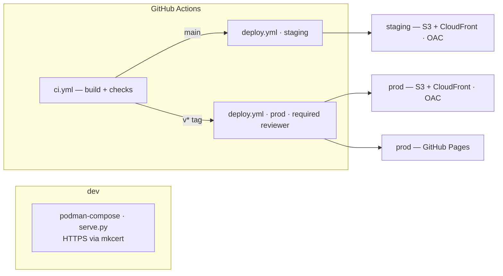
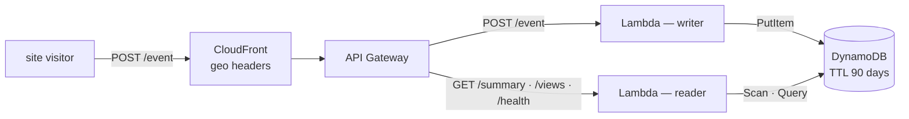
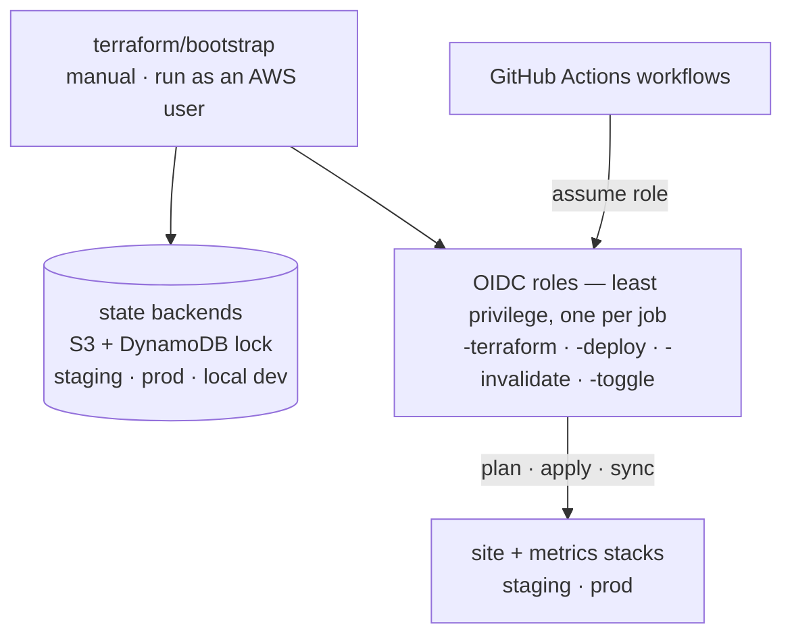
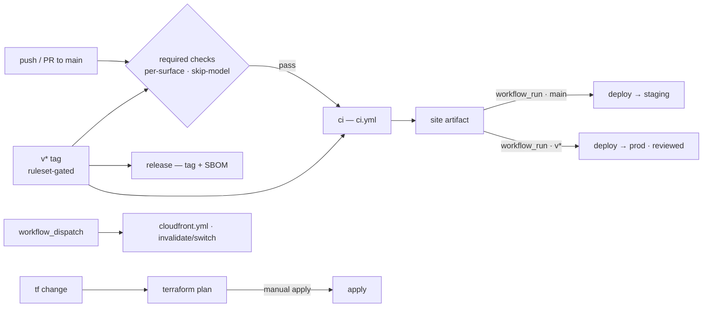

# Arquitectura de la Plataforma {#platform-architecture}

El [repositorio](https://github.com/mathewmusango/my-portfolio){ target="_blank" rel="noopener" }
detrás de este sitio es una plataforma de tres partes — **entrega de contenido**,
**métricas de visitantes** y el **plano de control de Terraform** detrás de
ambas. Son los mismos diagramas que lleva el
[README](https://github.com/mathewmusango/my-portfolio#architecture){ target="_blank" rel="noopener" }
del repositorio; esta página les da un hogar en el sitio. El mapa de
[Estructura del Sitio](structure.md) muestra dónde viven las páginas; esta
página muestra cómo funciona la plataforma.

## Sitio — entrega de contenido

**Prod está protegido por una puerta**: `v*` entrega un solo artefacto a ambos
planos de prod — el espejo AWS (S3 + CloudFront) y GitHub Pages (el sitio
canónico) — y ambos esperan al revisor obligatorio en el entorno `prod` de
GitHub, así que nada llega a prod sin revisión. Dos planos de entrega, cada uno
con su propia puerta: **contenido** — `main` → staging · `v*` → prod
(revisado); **infraestructura** — `main` → staging se aplica solo · `v*` →
solo plan en prod.

## Métricas — analítica de visitas

CloudFront suministra las cabeceras geo, por lo que **ninguna dirección IP llega
jamás a la Lambda**
([¿por qué?](https://github.com/mathewmusango/my-portfolio/blob/main/terraform/README.md#why-cloudfront){ target="_blank" rel="noopener" }).
Las lambdas escritora y lectora tienen cada una su propio rol de mínimo
privilegio; la API es pública pero restringida por origen. **staging** ejecuta su
propia pila; **prod** usa una sola; **dev** ejecuta Ministack (sin
edge). Los eventos brutos expiran a los 90 días.

## Terraform — el plano de control

`terraform/bootstrap` crea los backends de estado por entorno y los roles OIDC que
GitHub Actions asume para construir y ejecutar las pilas. **El bootstrap es el
único paso fuera de banda** — un usuario de AWS, fuera de GitHub Actions, los
crea; ningún workflow usa jamás claves.

## Cómo se publica un cambio

Referencia de implementación (cada workflow, rol y extra operativo):
[`.github/workflows/README.md`](https://github.com/mathewmusango/my-portfolio/blob/main/.github/workflows/README.md){ target="_blank" rel="noopener" }.
