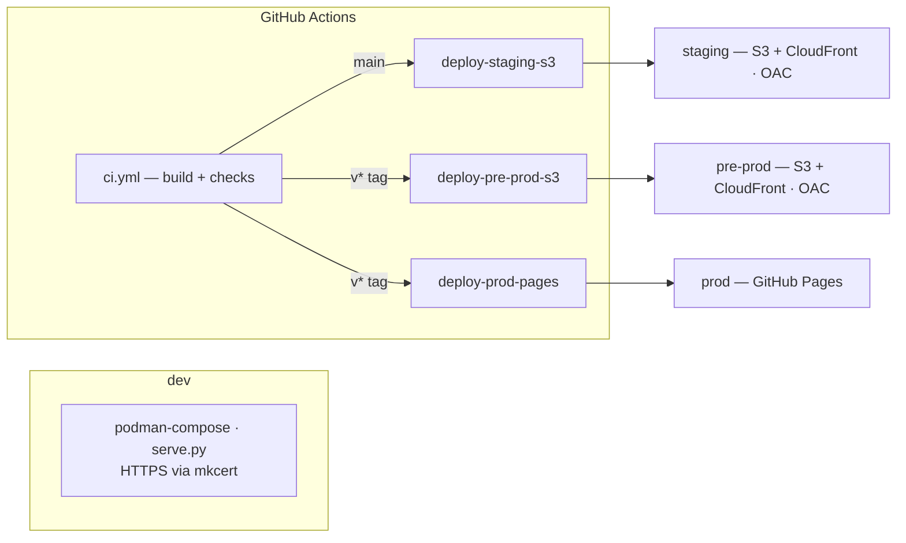
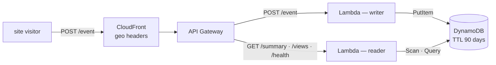
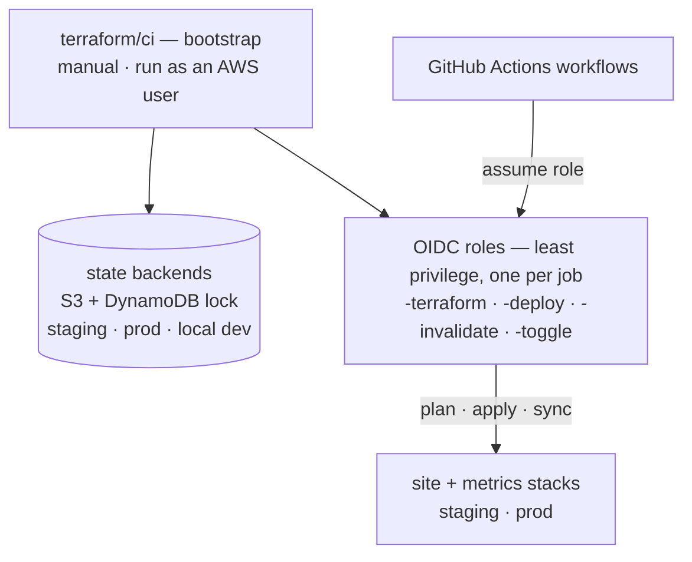
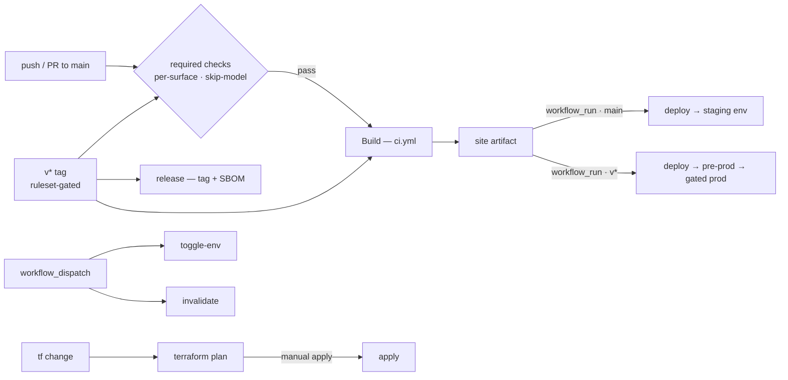

# 平台架构 {#platform-architecture}

本站背后的[仓库](https://github.com/mathewmusango/my-portfolio){ target="_blank" rel="noopener" }
是一个三部分平台 — **内容交付**、**访客指标**，以及支撑两者的 **Terraform
控制平面**。这些与仓库
[README](https://github.com/mathewmusango/my-portfolio#architecture){ target="_blank" rel="noopener" }
中的图表相同；本页为它们提供一个站点内的归宿。[站点结构](structure.md)地图显示
页面位于何处；本页展示平台如何运作。

## 站点 — 内容交付

**Prod 有闸门保护**：Pages 部署运行在 GitHub `prod` 环境的必需审阅者之后 — AWS
镜像（`pre-prod`）先上线，Pages 经批准后才发布。两条交付平面各有闸门：
**内容** — `main` → staging · `v*` → pre-prod → 带闸门 Pages；**基础设施** —
`main` → staging 自动 apply · `v*` → prod 仅 plan。

## 指标 — 访客分析

CloudFront 提供地理信息头，因此**任何 IP 地址都不会到达 Lambda**
（[为什么？](https://github.com/mathewmusango/my-portfolio/blob/main/terraform/README.md#why-cloudfront){ target="_blank" rel="noopener" }）。
写入和读取 Lambda 各有自己的最小权限角色；API 公开但受来源限制。**staging**
运行自己的栈；**pre-prod + prod** 共用一个；**dev** 运行 Ministack（无边缘）。
原始事件在 90 天后过期。

## Terraform — 控制平面

`terraform/ci` 创建按环境的 state 后端以及 GitHub Actions 用于构建和运行各栈的
OIDC 角色。**Bootstrap 是唯一带外步骤** — 一个 GitHub Actions 之外的 AWS 用户
创建它们；任何工作流都不会使用密钥。

## 变更如何发布

实现参考（每个工作流、角色和运维附加项）：
[`.github/workflows/README.md`](https://github.com/mathewmusango/my-portfolio/blob/main/.github/workflows/README.md){ target="_blank" rel="noopener" }。
