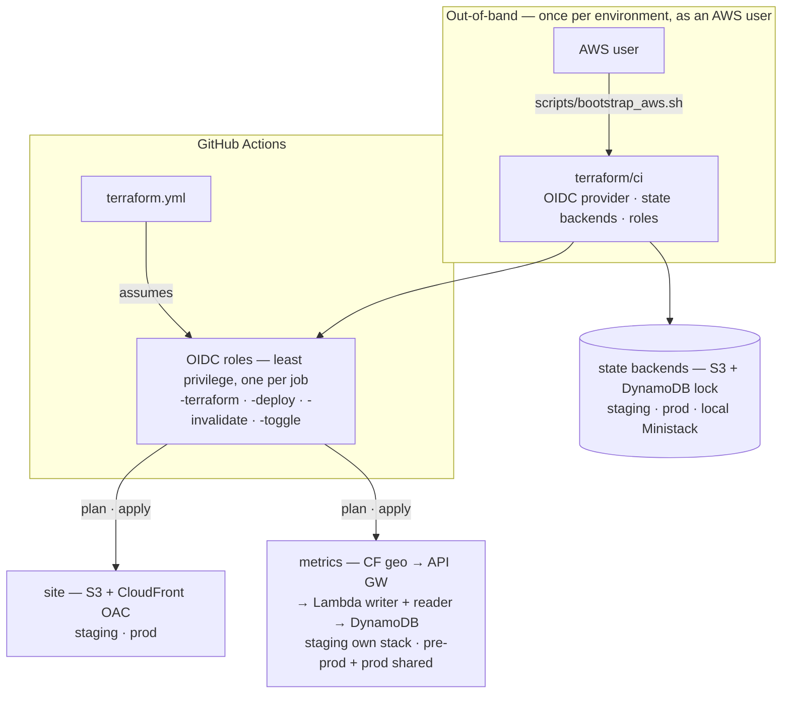

# Terraform — Portfolio Platform Infrastructure

Terraform defines the AWS infrastructure behind the portfolio product: **static-site delivery**
(private S3 bucket + CloudFront via OAC, serving at `/`) and **privacy-first visitor analytics**
(geo CloudFront edge → API Gateway → Lambda → DynamoDB) — `terraform/modules/metrics/`. Both
staging and prod run the full stack.

It does **not** build the MkDocs application: GitHub Actions builds the site artifact; Terraform
provisions and manages the infrastructure that serves it and collects telemetry.



The AWS-side picture at a glance — the details follow. (`pre-prod` deploys content onto the
**prod** stack; it is not a separate Terraform environment.)

## Design principles

1. **No long-lived CI credentials** — GitHub Actions assumes OIDC roles, one per job; only the
   one-time `terraform/ci` bootstrap runs as an AWS user (see the map above).
2. **Least-privilege IAM** — roles split by responsibility, scoped to their own resources.
3. **Private object storage** — site buckets are never public; served only through CloudFront OAC.
4. **Privacy-first telemetry** — geo from CloudFront headers only, no IPs stored, bounded retention (DynamoDB TTL).
5. **Low operating overhead** — free-tier-leaning defaults; hardening (WAF / VPC) is opt-in.

> Single repo (`mathewmusango/my-portfolio`). `terraform.yml` plans on any change to
> `terraform/**`: **main → staging (auto-apply), `v*` tags → prod (plan only — apply stays
> manual)**. Local dev applies against Ministack; real-AWS applies happen via the workflow
> (OIDC) or the CLI. Ops extras (`toggle-env`, `invalidate-cloudfront`) are documented in
> [`.github/workflows/README.md`](../.github/workflows/README.md).

> **On `pre-prod`:** the root README's deploy pipeline has a third stage, `pre-prod` — an
> AWS-hosted mirror of the canonical site, used to verify a release before it ships to GitHub
> Pages. It is not a separate Terraform environment: `pre-prod` runs on the same `prod` AWS
> stack documented here (site + metrics), so nothing below changes for it.

## Why CloudFront?

The requirement is **geographic location** (country/city) per visit. API Gateway
alone can't tell you where a viewer is — but CloudFront can, and it injects the
location as **request headers** that Lambda reads:

- `CloudFront-Viewer-Country` / `CloudFront-Viewer-Country-Name`
- `CloudFront-Viewer-City` / `CloudFront-Viewer-City-Name`
- `CloudFront-Viewer-Region`

That keeps the whole geo pipeline AWS-native: no GeoIP database, no license keys,
**no IP address ever stored** (the function only ever sees the headers CloudFront
provides — the visitor's raw IP never reaches DynamoDB).

Pipeline map: the root README's [Metrics section](../README.md#metrics--visitor-analytics) shows
the two-lambda flow (writer/reader) end to end.

## Resources

| Resource | Notes |
|---|---|
| `aws_dynamodb_table.metrics` | PK `date`, SK `evt#<uuid>`; GSI `page-date-index`; TTL on `ttl`; PAY_PER_REQUEST |
| `aws_lambda_function.metrics_writer` | Python 3.12, 128 MB / 10 s — `POST /event`; role grants `dynamodb:PutItem` only |
| `aws_lambda_function.metrics_reader` | Python 3.12, 128 MB / 10 s — `GET /summary` · `GET /views` · `GET /health`; role grants `dynamodb:Scan` + `dynamodb:Query` (table + GSI) |
| `aws_apigatewayv2_api.metrics` | HTTP API, CORS for the site origin, auto-deploy `$default` stage |
| `aws_apigatewayv2_route` ×4 | `POST /event` → writer · `GET /summary` · `GET /views` · `GET /health` → reader |
| `aws_cloudfront_distribution.metrics` | Edge + geo headers, CachingDisabled, HTTPS only |
| `aws_cloudfront_origin_request_policy.geo` | Whitelists geo + CORS + Content-Type headers |
| `aws_wafv2_web_acl.metrics` (real AWS, opt-in) | Default-block; allows only the site Origin/Referer + IP rate limit — **off by default (Free Tier)**; the Lambda origin gate is the free equivalent |
| VPC (real AWS, opt-in) | 2 private subnets, lambda SG (logs prefix-list egress), DynamoDB Gateway + Logs Interface endpoints — **off by default (Free Tier)**; the Logs interface endpoint is ~$7/mo |
| IAM | **Least privilege**: writer role = `AWSLambdaBasicExecutionRole` + `dynamodb:PutItem` on the table only; reader role = `AWSLambdaBasicExecutionRole` + `dynamodb:Scan` + `dynamodb:Query` (table + GSI); each function is invoked only by its own API route; + `AWSLambdaVPCAccessExecutionRole` when `enable_vpc` |

## Event schema (what's stored)

The beacon sends a tiny JSON body; the collector whitelists fields and enriches:

```jsonc
// POST /event  (body, ≤ 2 KB)
{ "type": "pageview", "page": "/metrics/", "lang": "en", "ref": "https://github.com/..." }

// event types: pageview · click (target: linkedin.com/…/email) ·
//              webvitals (metric: LCP/INP/CLS + value) · timing (ttfb/dcl/load)
// every event may carry: visitor (anonymous localStorage uuid) · device (mobile/desktop/tablet)

// stored item (DynamoDB)
{
  "date": "2026-08-22", "sk": "evt#<hex>", "ts": 1787350000,
  "type": "pageview", "page": "/metrics/", "lang": "en",
  "ref": "github.com",                      // hostname only — full referrers dropped
  "visitor": "<uuid>", "device": "mobile",   // anonymous id + coarse class — no cookies, no UA
  "country": "KE", "country_name": "Kenya", "city": "Nairobi", "region": "Nairobi County",
  "ttl": 1788100000                          // auto-deleted after EVENT_RETENTION days
}
```

- **Geo comes only from CloudFront headers** — never from the request's IP.
- Referrers are reduced to hostname; unknown body fields are ignored.
- Raw events expire via DynamoDB TTL (`event_retention_days`, default 90).

## Read path (`GET /summary`)

The collector scans recent events and aggregates in memory — `total`, `by_country`,
`by_page`, `by_lang`, `by_ref`, `by_hour`/`by_day`, `by_device`, `by_type`, and
`clicks`. Fine at portfolio traffic levels (scan cap 5000). **Follow-up**: a counters table fed by DynamoDB Streams, so
`/summary` becomes O(1) point reads — no scan.

## Deploy

### Credentials & endpoints — from the machine's AWS config (portable)

Nothing in this directory hardcodes an endpoint or a credential, and no env file
is needed. The provider is stock and reads the standard AWS chain:

- **Local Ministack** — `~/.aws/config` already carries everything:
  `endpoint_url = http://127.0.0.1:4566`, `region = us-east-1`; the keys
  (`test`/`test`) live in `~/.aws/credentials`. The provider honors the shared
  config `endpoint_url`, so `terraform` just works.
- **Real AWS** — your normal chain (`~/.aws/credentials` / SSO / CI secrets);
  no endpoint set. The same code targets real AWS unchanged.

The per-environment values the AWS config can't carry live in `local.tfvars`
(`environment`, `allowed_origin`, plus the required `project` / `aws_region` /
`tags`) — passed explicitly with `-var-file`, never auto-loaded. Real AWS gets
the same values from CI secrets at plan time; nothing is hardcoded in `*.tf`.

**Credentials never live in the repo.** And **the site itself needs no
credentials at all** — CloudFront is a public HTTPS edge; the browser beacon
just `POST`s to it, allowed by CORS from the site origin.

### Applying to real AWS

Real-AWS applies run through GitHub Actions (`terraform.yml`): staging auto-applies on `main`;
prod applies are manual dispatches — both via OIDC, no keys in workflows (see the auth model in
[`.github/workflows/README.md`](../.github/workflows/README.md)). Manual CLI applies exist only
for rare out-of-band work (e.g., a catch-up) and are documented in the project's **private
runbook** — intentionally not in this public repo.

CloudFront is ON by default (`enable_cloudfront = true`) — it is what adds the geo headers.

### Local dev (Ministack / LocalStack)

The dev machine runs **Ministack** (LocalStack-compatible) at `127.0.0.1:4566`.
Everything AWS comes from `~/.aws/config` + `~/.aws/credentials` (endpoint,
region, `test` keys) — no env file to source:

```sh
cd terraform
# Point state at Ministack S3 (recreate the bucket after a reset: aws s3 mb s3://my-portfolio-tfstate)
AWS_ENDPOINT_URL=http://127.0.0.1:4566 terraform init \
  -backend-config="bucket=my-portfolio-tfstate" -backend-config="key=metrics/terraform.tfstate" \
  -backend-config="region=us-east-1" -backend-config="encrypt=true"
export METRICS_ENDPOINT=$(terraform output -raw api_gateway_url)  # for the site beacon
AWS_ENDPOINT_URL=http://127.0.0.1:4566 terraform plan -var-file=local.tfvars
AWS_ENDPOINT_URL=http://127.0.0.1:4566 terraform apply -var-file=local.tfvars
```

`local.tfvars` mirrors staging/prod (same flags the `terraform.yml` plan step
passes): `enable_cloudfront`/`enable_metrics`/`enable_site` ON, VPC/WAF OFF.

CloudFront is created here too (Ministack implements the management plane), but
it has **no real edge locally** — `https://<dist>.cloudfront.net` only resolves
on real AWS. So the local site beacon uses `api_gateway_url`
(`http://<api-id>.execute-api.localhost:4566`) and geo fields read `"unknown"`.

Then verify the pipeline (Ministack's own `/health` on 4566 shadows the API's
`GET /health` locally — test with `/event` and `/summary` instead; `/health` is
reachable on real AWS):

```sh
# The origin gate is HTTPS-only — cleartext origins are always rejected. The
# dev site is HTTPS (mkcert CA, certs/), so use its https origin — the same
# one local.tfvars allows — to exercise the pipeline locally:
curl -X POST http://<api-id>.execute-api.localhost:4566/event \
  -H 'Content-Type: application/json' -H 'Origin: https://portfolio.mathewmusango.test:8000' \
  -d '{"type":"pageview","page":"/","lang":"en"}'
curl http://<api-id>.execute-api.localhost:4566/summary -H 'Origin: https://portfolio.mathewmusango.test:8000'
```

### Backend (state)

**Portable S3 backend** — `versions.tf` declares `backend "s3" {}` with no values:
bucket, key, region and the DynamoDB lock table are supplied at init via
`-backend-config`, so the module works for any project/region. Per-environment
buckets (`<project>-<env>-tfstate` + `<project>-<env>-tfstate-lock`) are created
by the `terraform/ci` module (`scripts/bootstrap_aws.sh`). Example init:

```sh
# Bucket/lock names derive from <project>-<env> — set the shared values once:
export PROJECT=my-portfolio
export ENVIRONMENT=prod        # main → staging · v* tags → prod
terraform init \
  -backend-config="bucket=${PROJECT}-${ENVIRONMENT}-tfstate" \
  -backend-config="key=metrics/terraform.tfstate" \
  -backend-config="region=us-east-1" \
  -backend-config="dynamodb_table=${PROJECT}-${ENVIRONMENT}-tfstate-lock" \
  -backend-config="encrypt=true"
```

CI does the same automatically: bucket and lock names are derived from the
shared project secret + the trigger-resolved environment (main → staging, `v*` tags →
prod), region from the AWS-region secret — all secrets, nothing in the repo.
Local dev points at the bucket via `AWS_ENDPOINT_URL` (Ministack) or real S3.

## Site integration

The backend is wired to the site:

- **Beacon** — `docs/javascripts/metrics-beacon.js` (site-wide) POSTs a pageview
  on every page load: `{ type, page, lang }`. It reads the endpoint from a
  `<meta name="metrics-endpoint">` tag, which `overrides/main.html` emits only
  when `METRICS_ENDPOINT` is set at build/serve time (mkdocs.yml `!ENV`).
  Empty endpoint = beacon no-ops (prod, until the real stack deploys). The dev
  container passes the host's `METRICS_ENDPOINT` through (`compose.yaml`).
  **Endpoint by environment:** local dev → `terraform output api_gateway_url`
  (Ministack has no real edge); real AWS staging and prod → `terraform output api_url`
  (`https://<cloudfront>.cloudfront.net`) — the public edge the browser hits.
- **Per-page counter** — `GET /views?page=<path>` exists (a Query on the
  `page-date-index` GSI — no full scan per page load) for per-page counts;
  the tab/footer counters that used it were removed from the UI (2026-08-25).
- **Dashboard** — `docs/javascripts/metrics-live.js` (metrics page only) fetches
  `GET /summary` and renders live totals + top pages; labels stay in the page
  markup so they translate per language. The "Visitor analytics" card is Live.

Uptime = external probes hitting `/health`. `type: "webvitals"` events are already captured by
the writer (`metric`/`value`, timings); surfacing them on the metrics page is future work.

## Security (Free-Tier defaults, opt-in hardening)

**The API is public by design, restricted to requests presenting the configured site origin** —
an application-layer origin gate, enforced for free. It is **not authentication** — any client
can set an `Origin`/`Referer` header; optional WAF / rate limiting adds edge protection.

1. **Lambda origin gate** (all environments, incl. local): the writer and reader
   reject any request whose `Origin`/`Referer` host doesn't equal
   `allowed_origin` — including requests with **no** header at all (403).
   `/health` is exempt (uptime probes carry no Origin/Referer and return no data).
2. **Least-privilege IAM**: writer = `dynamodb:PutItem` on the table only;
   reader = `dynamodb:Scan` + `dynamodb:Query` (table + GSI — per-page `/views`);
   each function is invoked only by its own API route.

**Opt-in hardening (outside the Free Tier — ~$14/mo total):**

- **WAF on the CloudFront edge** (`enable_waf`): request filtering on the configured site origin
  (derived from `allowed_origin` — the WAF search string is the module's first allowed host) plus
  an IP rate-limit rule (300 req / 5 min), default *block*. Origin/Referer filtering here is an
  **abuse-control measure, not authentication**. ~$7/mo.
- **Private VPC** (`enable_vpc`): lambdas with **no internet path** — egress only
  to the DynamoDB **Gateway** (free) and CloudWatch Logs **Interface** endpoints.
  The Logs endpoint is ~$7/mo; cold starts gain ~0.5–1 s from the ENI attach.

**Cost note (real AWS):** designed for very low operating cost at portfolio-scale traffic — the
defaults (both opt-ins off) minimize fixed-cost services: CloudFront, API Gateway, Lambda, and
DynamoDB free-tier usage cover typical traffic. WAF and the Logs interface endpoint are the only
always-billable components.

**Local (Ministack):** `local.tfvars` sets `enable_vpc = false` and
`enable_waf = false` — matching the Free-Tier default; the lambda origin gate
still applies.

## Operations

- **CORS**: configured on the HTTP API for `allowed_origin` (default the live
  site). API responses carry `Access-Control-Allow-*` regardless.
- **No auth on the API** — it's a public beacon by design; payloads are validated
  and size-capped, and the origin gate (plus WAF when enabled) restrict who can call it.
- **No secrets** in this directory; AWS access comes from the machine's credential
  chain.
- **Test vs prod**: local dev applies with `environment = "test"` (see
  `local.tfvars`) — resource names and the table are prefixed, so both can
  coexist. **Terraform runs via GitHub Actions** — `terraform.yml` plans on
  `terraform/**` changes; staging auto-applies on `main`, prod applies manually
  (see the map above + `.github/workflows/README.md` for roles/secrets).
