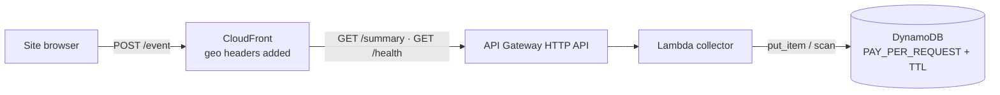

# Terraform — Site + Metrics stack (S3/CloudFront site · gated API Gateway/Lambda/DynamoDB)

**Site-first:** the live stack is the static site (private S3 bucket + CloudFront via OAC,
serving at `/`). The metrics backend (API Gateway → Lambda → DynamoDB, geo CloudFront edge) is
gated behind `enable_metrics=false` until the metrics phase — `terraform/modules/metrics/`.

Privacy-first visitor analytics for `my-portfolio`, built as real infrastructure:
**CloudFront → API Gateway (HTTP API) → Lambda → DynamoDB**, all defined in Terraform.

> Branch: `feature/terraform-metrics-infra`. Terraform is **not promoted to prod**
> and prod runs no terraform — the test repo's `terraform.yml` workflow plans on
> any change to `terraform/**` and applies only via manual `workflow_dispatch`
> (see `DEVOPS.md` §7.1 + §10.4). Local dev applies against Ministack; real-AWS
> applies happen via the workflow or the CLI.

## Why CloudFront?

The requirement is **geographic location** (country/city) per visit. API Gateway
alone can't tell you where a viewer is — but CloudFront can, and it injects the
location as **request headers** that Lambda reads:

- `CloudFront-Viewer-Country` / `CloudFront-Viewer-Country-Name`
- `CloudFront-Viewer-City` / `CloudFront-Viewer-City-Name`
- `CloudFront-Viewer-Region`

That keeps the whole geo pipeline AWS-native: no GeoIP database, no license keys,
**no IP address ever stored** (the function only ever sees the headers CloudFront
provides — the visitor's raw IP never reaches DynamoDB).



## Resources

| Resource | Notes |
|---|---|
| `aws_dynamodb_table.metrics` | PK `date`, SK `evt#<uuid>`; GSI `page-date-index`; TTL on `ttl`; PAY_PER_REQUEST |
| `aws_lambda_function.metrics_writer` | Python 3.12, 128 MB / 10 s — `POST /event`; role grants `dynamodb:PutItem` only |
| `aws_lambda_function.metrics_reader` | Python 3.12, 128 MB / 10 s — `GET /summary` · `GET /views` · `GET /health`; role grants `dynamodb:Scan` + `dynamodb:Query` (table + GSI) |
| `aws_apigatewayv2_api.metrics` | HTTP API, CORS for the site origin, auto-deploy `$default` stage |
| `aws_apigatewayv2_route` ×4 | `POST /event` → writer · `GET /summary` · `GET /views` · `GET /health` → reader |
| `aws_cloudfront_distribution.metrics` | Edge + geo headers, CachingDisabled, HTTPS only |
| `aws_cloudfront_origin_request_policy.geo` | Whitelists geo + CORS + Content-Type headers |
| `aws_wafv2_web_acl.metrics` (real AWS, opt-in) | Default-block; allows only the site Origin/Referer + IP rate limit — **off by default (Free Tier)**; the Lambda origin gate is the free equivalent |
| VPC (real AWS, opt-in) | 2 private subnets, lambda SG (logs prefix-list egress), DynamoDB Gateway + Logs Interface endpoints — **off by default (Free Tier)**; the Logs interface endpoint is ~$7/mo |
| IAM | **Least privilege**: writer role = `AWSLambdaBasicExecutionRole` + `dynamodb:PutItem` on the table only; reader role = `AWSLambdaBasicExecutionRole` + `dynamodb:Scan` on the table only; each function is invoked only by its own API route; + `AWSLambdaVPCAccessExecutionRole` when `enable_vpc` |

## Event schema (what's stored)

The beacon sends a tiny JSON body; the collector whitelists fields and enriches:

```jsonc
// POST /event  (body, ≤ 2 KB)
{ "type": "pageview", "page": "/metrics/", "lang": "en", "ref": "https://github.com/..." }

// event types: pageview · click (target: linkedin.com/…/email) ·
//              webvitals (metric: LCP/INP/CLS + value) · timing (ttfb/dcl/load)
// every event may carry: visitor (anonymous localStorage uuid) · device (mobile/desktop/tablet)

// stored item (DynamoDB)
{
  "date": "2026-08-22", "sk": "evt#<hex>", "ts": 1787350000,
  "type": "pageview", "page": "/metrics/", "lang": "en",
  "ref": "github.com",                      // hostname only — full referrers dropped
  "visitor": "<uuid>", "device": "mobile",   // anonymous id + coarse class — no cookies, no UA
  "country": "KE", "country_name": "Kenya", "city": "Nairobi", "region": "Nairobi County",
  "ttl": 1788100000                          // auto-deleted after EVENT_RETENTION days
}
```

- **Geo comes only from CloudFront headers** — never from the request's IP.
- Referrers are reduced to hostname; unknown body fields are ignored.
- Raw events expire via DynamoDB TTL (`event_retention_days`, default 90).

## Read path (`GET /summary`)

The collector scans recent events and aggregates in memory: `total`,
`by_country`, `by_page`, `by_lang`. This is fine at portfolio traffic levels
(scan cap 5000). **Follow-up**: a counters table fed by DynamoDB Streams, so
`/summary` becomes O(1) point reads — no scan.

## Deploy

### Credentials & endpoints — from the machine's AWS config (portable)

Nothing in this directory hardcodes an endpoint or a credential, and no env file
is needed. The provider is stock and reads the standard AWS chain:

- **Local Ministack** — `~/.aws/config` already carries everything:
  `endpoint_url = http://127.0.0.1:4566`, `region = us-east-1`; the keys
  (`test`/`test`) live in `~/.aws/credentials`. The provider honors the shared
  config `endpoint_url`, so `terraform` just works.
- **Real AWS** — your normal chain (`~/.aws/credentials` / SSO / CI secrets);
  no endpoint set. The same code targets real AWS unchanged.

The per-environment values the AWS config can't carry live in `local.tfvars`
(`environment`, `allowed_origin`, plus the required `project` / `aws_region` /
`tags`) — passed explicitly with `-var-file`, never auto-loaded. Real AWS gets
the same values from CI secrets at plan time; nothing is hardcoded in `*.tf`.

**Credentials never live in the repo.** And **the site itself needs no
credentials at all** — CloudFront is a public HTTPS edge; the browser beacon
just `POST`s to it, allowed by CORS from the site origin.

### Real AWS (production)

```sh
cd terraform
terraform init          # downloads aws + archive providers
export AWS_ACCESS_KEY_ID=... AWS_SECRET_ACCESS_KEY=... AWS_DEFAULT_REGION=us-east-1
terraform plan -out=tf.plan   # default: environment=prod, CloudFront ON
terraform apply tf.plan
terraform output api_url   # → https://<cloudfront>.cloudfront.net  ← beacon endpoint
```

- CloudFront is ON by default (`enable_cloudfront = true`) — it is what adds the
  geo headers. **Cost:** PAY_PER_REQUEST table (no idle cost at low traffic) +
  Lambda + CloudFront — effectively pennies at portfolio scale; CloudFront data
  transfer is the main line.

### Local dev (Ministack / LocalStack)

The dev machine runs **Ministack** (LocalStack-compatible) at `127.0.0.1:4566`.
Everything AWS comes from `~/.aws/config` + `~/.aws/credentials` (endpoint,
region, `test` keys) — no env file to source:

```sh
cd terraform
terraform init
export METRICS_ENDPOINT=$(terraform output -raw api_gateway_url)  # for the site beacon
terraform plan -var-file=local.tfvars
terraform apply -var-file=local.tfvars
```

CloudFront is created here too (Ministack implements the management plane), but
it has **no real edge locally** — `https://<dist>.cloudfront.net` only resolves
on real AWS. So the local site beacon uses `api_gateway_url`
(`http://<api-id>.execute-api.localhost:4566`) and geo fields read `"unknown"`.

Then verify the pipeline (LocalStack's own `/health` shadows the API's `/health`
route locally — test with `/event` and `/summary` instead):

```sh
curl -X POST http://<api-id>.execute-api.localhost:4566/event \
  -H 'Content-Type: application/json' -H 'Origin: http://localhost:8000' \
  -d '{"type":"pageview","page":"/","lang":"en"}'
curl http://<api-id>.execute-api.localhost:4566/summary
```

> The API Gateway route `GET /health` is deployed but locally shadowed by
> Ministack's own health check on port 4566 — reachable on real AWS.

### Backend (state)

**Portable S3 backend** — `versions.tf` declares `backend "s3" {}` with no values:
bucket, key, region and the DynamoDB lock table are supplied at init via
`-backend-config`, so the module works for any project/region. Per-environment
buckets (`<project>-<env>-tfstate` + `<project>-<env>-tfstate-lock`) are created
by the `terraform/ci` module (`scripts/bootstrap-aws.sh`). Example init:

```sh
terraform init \
  -backend-config="bucket=my-portfolio-prod-tfstate" \
  -backend-config="key=metrics/terraform.tfstate" \
  -backend-config="region=us-east-1" \
  -backend-config="dynamodb_table=my-portfolio-prod-tfstate-lock" \
  -backend-config="encrypt=true"
```

CI does the same automatically: bucket and lock names are derived from the
`PROJECT` secret + the trigger-resolved environment (main → staging, `v*` tags →
prod), region from the `AWS_REGION` secret — all secrets, nothing in the repo.
Local dev points at the bucket via `AWS_ENDPOINT_URL` (Ministack) or real S3.

## Site integration (done on this branch)

The backend is wired to the site:

- **Beacon** — `docs/javascripts/metrics-beacon.js` (site-wide) POSTs a pageview
  on every page load: `{ type, page, lang }`. It reads the endpoint from a
  `<meta name="metrics-endpoint">` tag, which `overrides/main.html` emits only
  when `METRICS_ENDPOINT` is set at build/serve time (mkdocs.yml `!ENV`).
  Empty endpoint = beacon no-ops (prod, until the real stack deploys). The dev
  container passes the host's `METRICS_ENDPOINT` through (`compose.yaml`).
  **Endpoint by environment:** local dev → `terraform output api_gateway_url`
  (Ministack has no real edge); real AWS prod → `terraform output api_url`
  (`https://<cloudfront>.cloudfront.net`) — the public edge the browser hits.
- **Per-page counter** — `GET /views?page=<path>` exists (a Query on the
  `page-date-index` GSI — no full scan per page load) for per-page counts;
  the tab/footer counters that used it were removed from the UI (2026-08-25).
- **Dashboard** — `docs/javascripts/metrics-live.js` (metrics page only) fetches
  `GET /summary` and renders live totals + top pages; labels stay in the page
  markup so they translate per language. The "Visitor analytics" card is Live.

```js
// Beacon payload (what actually lands in DynamoDB)
{ "type": "pageview", "page": "/my-portfolio/metrics/", "lang": "en" }
```

Uptime = external probes hitting `/health`; Performance = future
`type: "webvitals"` events.

## Security (Free-Tier default, opt-in hardening)

**Only the site may reach the API** — enforced at the application layer, free:

1. **Lambda origin gate** (all environments, incl. local): the writer and reader
   reject any request whose `Origin`/`Referer` host doesn't equal
   `allowed_origin` — including requests with **no** header at all (403).
   `/health` is exempt (uptime probes carry no Origin/Referer and return no data).
2. **Least-privilege IAM**: writer = `dynamodb:PutItem` on the table only;
   reader = `dynamodb:Scan` only; each function is invoked only by its own
   API route.

**Opt-in hardening (outside the Free Tier — ~$14/mo total):**

- **WAF on the CloudFront edge** (`enable_waf`): default *block*; only requests
  whose `Origin`/`Referer` contains the site's host (derived from
  `allowed_origin` — the WAF search string is the module's first allowed host)
  are allowed, plus an IP rate-limit rule (300 req / 5 min). ~$7/mo.
- **Private VPC** (`enable_vpc`): lambdas with **no internet path** — egress only
  to the DynamoDB **Gateway** (free) and CloudWatch Logs **Interface** endpoints.
  The Logs endpoint is ~$7/mo; cold starts gain ~0.5–1 s from the ENI attach.

**Cost note (real AWS):** the Free-Tier default (both off) costs ~$0 fixed —
CloudFront, API Gateway, Lambda, and DynamoDB (always-free tier) cover the
usage. WAF + the Logs endpoint are the only always-billable items.

**Local (Ministack):** `local.tfvars` sets `enable_vpc = false` and
`enable_waf = false` — matching the Free-Tier default; the lambda origin gate
still applies.

## Operations

- **CORS**: configured on the HTTP API for `allowed_origin` (default the live
  site). API responses carry `Access-Control-Allow-*` regardless.
- **No auth on the API** — it's a public beacon by design; payloads are validated
  and size-capped, and the origin gate (plus WAF when enabled) restrict who can call it.
- **No secrets** in this directory; AWS access comes from the machine's credential
  chain.
- **Test vs prod**: this is the live-site stack (prod metrics). Local dev applies
  with `environment = "test"` (see `local.tfvars`) — resource names and the
  table are prefixed, so both can coexist. **Terraform runs via GitHub
  Actions** — `.github/workflows/terraform.yml` (identical in both repos) plans
  on any change to `terraform/**` and applies only on manual `workflow_dispatch`
  (OIDC, `AWS_ROLE_ARN` + `AWS_REGION` repo vars); prod is the operational repo.
